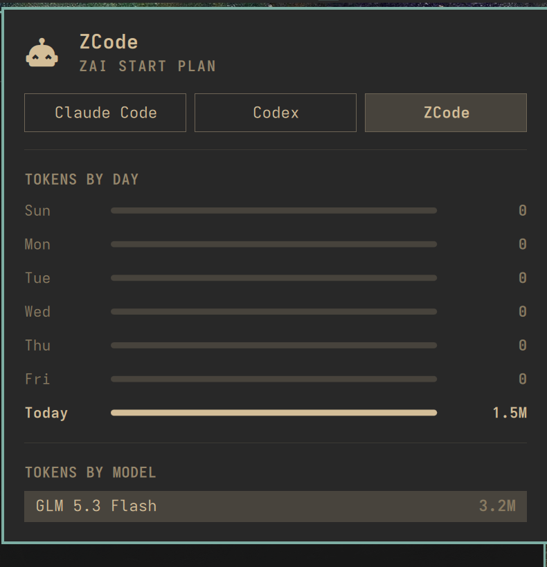

# ZCode Usage for Omarchy

Adds a **ZCode** subscription to the built-in **Agents** bar panel, next to
Claude Code and Codex: plan label, tokens by day for the last week, and the
all-time token breakdown by model (hover a row for the input / output / cache
split).



This plugin is only the data feed. It ships a small collector that reads
ZCode's local usage database and writes the same JSON record format the
built-in `omarchy.agents` panel already renders — install it and the ZCode tab
appears in the panel you already have. No second bar icon, no duplicate panel.

## What it shows

- **Plan label** — detected from ZCode's plan cache (e.g. "Zai Start Plan").
- **Tokens by day** — one row per day for the last week, today bolded.
- **Tokens by model** — all-time tokens per model with a share bar.
- No rate-limit meters: Z.ai's coding plan has no local quota endpoint, so
  the panel only renders the local statistics for this agent.

All numbers are read-only local statistics: per-turn and per-model-request
token counts from ZCode's own SQLite database at `~/.zcode/cli/db/db.sqlite`,
opened in read-only mode. Nothing is sent anywhere.

## Requirements

- [Omarchy](https://omarchy.org) (the built-in Agents panel must be present —
  it is part of the default bar layout)
- [ZCode](https://zcode.z.ai) with at least one recorded session
- `python3` (standard library only, no packages)

## Install

```sh
omarchy plugin add https://github.com/xqliu/omarchy-zcode-usage --enable
```

The service starts with the shell, writes
`~/.local/state/omarchy/agents/usage/zcode.json`, and nudges the Agents panel
to rescan — the ZCode tab appears without a restart. After that it refreshes
every 5 minutes.

## Remove

```sh
omarchy plugin remove io.github.xqliu.zcode-usage
rm -f ~/.local/state/omarchy/agents/usage/zcode.json
```

Removing the plugin stops the collector; the second command clears the last
record so the tab disappears immediately.

## Files it touches

| Path | Why |
|---|---|
| `~/.zcode/cli/db/db.sqlite` | Read-only: source of the usage numbers |
| `~/.zcode/v2/coding-plan-cache.json` | Read-only: plan label |
| `~/.local/state/omarchy/agents/usage/zcode.json` | Written: the usage record |

It never modifies ZCode or Omarchy configuration.

## How it works

The manifest declares the `service` kind, so Omarchy's shell runs
`Service.qml` as a headless singleton for as long as the plugin is enabled.
Every 5 minutes it runs the bundled `collector.py`, which opens the database
read-only, aggregates per-turn totals (`turn_usage`) and per-model totals
(`model_usage`) into the agents panel's record contract, and rewrites the
record atomically. The agents panel watches that directory and renders the
rest.

## License

[MIT](LICENSE)
